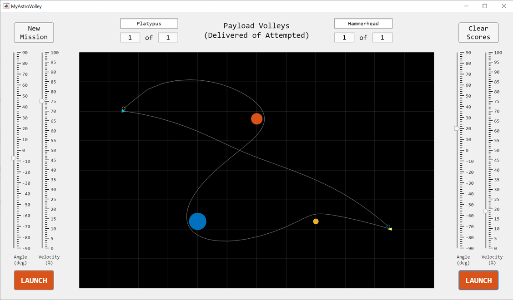

# AstroVolley Courseware

AstroVolley is free courseware authored by MathWorks&reg; to help teach students the basics of plotting and app building with MATLAB&reg;. During this course students will create their own astrodynamics game where navigators attempt to deliver payloads between star cruisers by volleying them through fantastical gravity fields.

## Course Lesson Plan (~1 hour each)

### Installing and Playing AstroVolley
### Plotting
* Plotting Ships (Triangles)
* Plotting Gravitational Bodies (Circles)
* Gravity and Orbits
* Launching Volleys
  * Creating a Random Mission Map
  * Plotting Velocity Vectors (`quiver`)
  * Animating Trajectories (`comet`)
### App Building (with App Designer)
* UIAxes, Properties, and Functions
* Sliders and Value Changing Callbacks
* Push Button Callbacks
* Generating a Random Map
* Keeping Score

Please see the [AstroVolley Instructor Guide](AstroVolley_InstructorGuide.pdf) for more details.

## Requirements and Recommended Prerequisites 
* MATLAB R2021b (or later)
* Ages: 11+
* Completing *any* of the following courses...
  * [Pixels to Pictures](https://www.mathworks.com/academia/courseware/pixels-to-pictures.html)
  * [Bytes and Beats](https://www.mathworks.com/academia/courseware/bytes-and-beats.html) 
  * [MATLAB Learn to Code](https://learntocode.mathworks.com/)
  * [MATLAB Onramp](https://www.mathworks.com/learn/tutorials/matlab-onramp.html)

## License
The license for AstroVolley Courseware is available in the [license.txt](license.txt) file in this GitHub repository.

## Community Support
* [MATLAB Courseware](https://www.mathworks.com/academia/highschool/courseware.html)
* [MATLAB Central](https://www.mathworks.com/matlabcentral)

Copyright 2022 The MathWorks, Inc.
